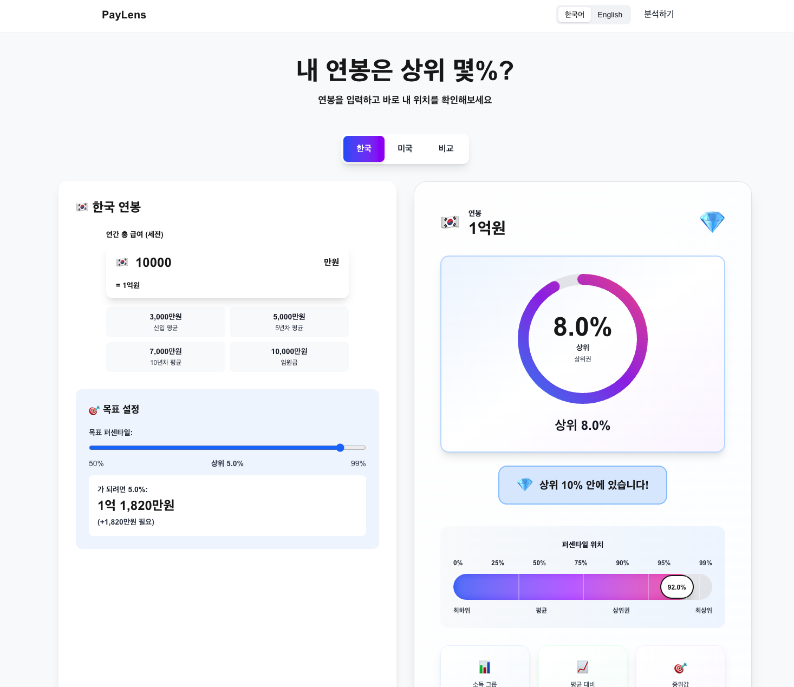

# PayLens 💰

> 내 연봉은 상위 몇%? 정확한 데이터로 당신의 소득 위치를 렌즈처럼 선명하게 보여드립니다.

[](https://paylens-kappa.vercel.app)

## 📸 스크린샷

### 연봉 입력 화면

*한국/미국 선택 후 연봉을 입력하면 즉시 퍼센타일을 확인할 수 있습니다*

### 분석 결과 화면

*상위 퍼센타일, 소득 그룹, 목표 설정 등 상세한 분석 정보를 제공합니다*

## 🎯 주요 기능

- **실시간 퍼센타일 분석** - 연봉 입력만으로 즉시 상위 몇%인지 확인
- **한국/미국 데이터 지원** - 국세청과 US Census Bureau 공식 데이터 기반
- **목표 설정** - 원하는 퍼센타일 도달에 필요한 소득 계산
- **국가 간 비교** - 동일 퍼센타일 기준 국가 간 소득 비교

## 🚀 시작하기

### 개발 환경 실행

```bash
# 의존성 설치
npm install

# 개발 서버 실행
npm run dev

# 브라우저에서 열기
open http://localhost:3000
```

### 프로덕션 빌드

```bash
# 프로덕션 빌드
npm run build

# 프로덕션 실행
npm start
```

## 🛠 기술 스택

- **Framework**: Next.js 15.5.3 (App Router)
- **Language**: TypeScript
- **Styling**: Tailwind CSS
- **Animation**: Framer Motion
- **State**: Zustand
- **Deployment**: Vercel

## 📊 데이터 출처

- **한국**: 국세청 근로소득 백분위 자료 (2024년)
- **미국**: US Census Bureau (2024년)

## 📝 라이선스

MIT License

## 👥 기여자

- Kelly - Project Owner
- Claude - AI Assistant

---

Made with ❤️ by Kelly & Claude